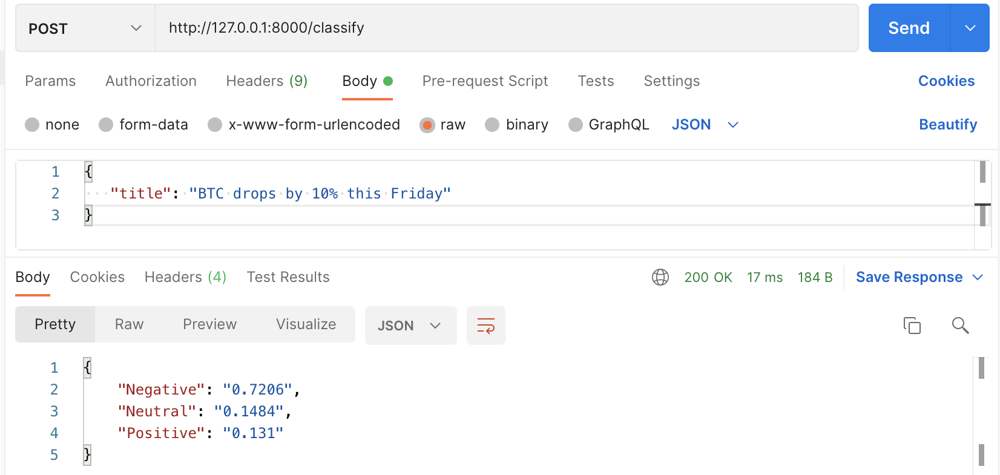

# Cryptonews sentiment classification model

This is a simple cryptonews sentiment classification Fast API.



## Data

The training set is comprised of ~4500 news titles manually classiified into positive, neutral or negative. The data is not shared but you can refer to a toy dataset with 50 records: `data/toy_train.csv`.

```
title,sentiment
Bitcoin Market Has Run Out of Juice: Cryptocurrency Analyst,Negative
Bitcoin Core 0.14.0 Speeds Up Blockchain Syncing By 48%,Positive
Thinking of Travelling With Bitcoin? With These Websites You Can,Positive
```

## Model

The model is a simple Tf-Idf & logreg Sklearn [Pipeline](https://scikit-learn.org/stable/modules/generated/sklearn.pipeline.Pipeline.html). To reproduce model training, perform the following steps:

1. Set up the environment. In case of virtual envs:
  - `python3 -m venv crypto_sentiment_mlops_venv`
  - `source crypto_sentiment_mlops_venv/bin/activate`
  - `pip3 install -r requirements.txt`
2. Check project configurations defined in `config.yml`, e.g. model parameters and path to the model, etc.
3. Run `python3 -m src.train` (might take a while for the first time, even with a small dataset)

## API

Here we are using Fast API, [first steps](https://fastapi.tiangolo.com/tutorial/first-steps/).

To run the API locally: ```uvicorn src.api:app --reload```

Then you can talk to the `http://127.0.0.1:8000/classify` endpoint sending text data as a dictionary with text field as a key and arbitrary text as a value, e.g.

```
{
   "title": "BTC drops by 10% this Friday"
}
```

Example of a Curl request:

```
curl --location --request POST 'http://127.0.0.1:8000/classify' \
--header 'Content-Type: application/json' \
--data-raw '{ "title": "BTC drops by 10% this Friday" }'
```


### API docs

* Swagger UI: [http://localhost:8000/docs](http://localhost:8000/docs)
* ReDoc: [http://localhost:8000/redoc](http://localhost:8000/redoc)
